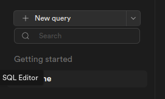

# Repo Chat

Repo chat allows you to ask questions about a GitHub repository.

## Requirements

In this project we use [OpenAI embeddings](https://platform.openai.com/docs/guides/embeddings) and [Supabase with pgvector](https://supabase.com/docs/guides/database/extensions/pgvector) as our vector database.

You can switch out either of these with your own preference.

## How To Run

1. Go to [Supabase](https://supabase.com/)
2. Create your account, if you already don’t have it. 
3. Once your account is created, click on **All projects>Create Project**
4. Put your project name, then it will give you a Supabase URL and a service key. 
5. Copy .env.example file and rename it as .env
6. Change the Supabase URL and the key in the .env file
7. Now, click on your project name on Supabase, and click on the SQL Editor menu which is on the left sidebar. 

8. Open schema.sql file in your IDE, copy it and paste in the Supabase's Query Editor, Hit Run.

9. Configure the `.env` file with your repo url, repo branch of your choice, openai key, make sure you changed the Supabase's URL and key in the step 6.

10. Run `pip install -r requirements.txt` to install the dependencies.

11. Run the `python3 load.py` script to clone the repo.

12. Run the `python3 embed.py` script to embed the repo.

13. Run the `python3 main.py` script to ask questions about the repo.

## Contact

If you have any questions, feel free to reach out to Mckay on [Twitter](https://twitter.com/mckaywrigley)!
